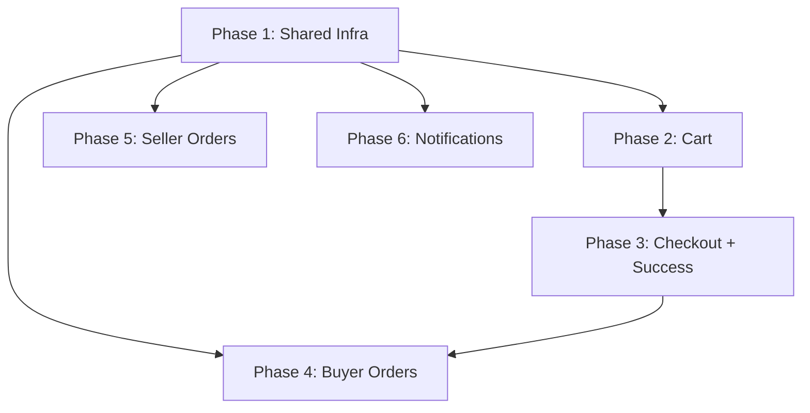

# Implementation Plan — Order & Delivery Flow

> Dựa trên: Pencil screens (`figma-pencil.pen`) + codebase hiện tại + `AGENTS.md`

---

## Tổng quan hiện trạng

### Đã có trong codebase
| Item | File | Ghi chú |
|---|---|---|
| Axios instance + interceptor | `services/authService.js` | `api` default export — tất cả service mới import từ đây |
| Admin service pattern | `services/adminService.js` | Mẫu tham chiếu cho `orderService.js`, `cartService.js` |
| Auth context | `context/AuthContext.jsx` | `useAuth()` → `user`, `token`, `login`, `logout` |
| Role routing | `components/common/RoleBasedRoute.jsx` | Wrap route với `allowedRoles` |
| Navbar / Footer | `components/common/` | Dùng lại cho tất cả buyer pages |
| OrderHistory (stub) | `components/profile/OrderHistory.jsx` | Hardcoded data, cần thay bằng API thật |
| Admin page pattern | `pages/admin/index.jsx` | Canonical: `useMemo` filter + pagination + modal |
| Tailwind theme | `tailwind.config.js` | `brand.50–900`, `cream`, `dark`, font `Be Vietnam Pro` |

### Pencil screens có sẵn (13/13 hoàn chỉnh)

| # | Pencil Frame | ID | Màn hình |
|---|---|---|---|
| 1 | Giỏ hàng - Cart Page | `Bunja` | Cart with product cards + checkout summary |
| 2 | Thanh toán - Checkout Page | `EDCeO` | Shipping form + payment + confirm |
| 3 | Đặt hàng thành công | `R8MDBp` | Success card with order code |
| 4 | Lịch sử đơn hàng | `vvqtY` | Order list with tabs |
| 5 | Chi tiết đơn hàng - user | `GyUjt` | Order detail base |
| 5a–e | Chi tiết các trạng thái | `EDgPA`, `K1VWe`, `JXWq2`, `bRgOX`, `X9XuF4` | Pending / Confirmed / Packed / Delivered / Cancelled |
| 6 | Dialog huỷ đơn - Buyer | `zqByN` | Modal overlay with reasons |
| 7 | Dialog hoàn tiền - Buyer | `R8LB6K` | Modal overlay with textarea |
| 8 | Quản lý đơn hàng - Seller | `G2ts26` | Seller order list |
| 9 | Chi tiết đơn hàng - Seller | `G4g6R` | Seller order detail |
| 10 | Dialog huỷ đơn - Seller | `KN0y4` | Modal overlay |
| 11 | Thông báo | `Tj6oa` | Notification list page |
| 12 | Shared: Status Badge + Timeline | `n1WoU` | 6 badge variants + vertical timeline |

---

## Kiến trúc files (tổng thể)

```
src/
├── services/
│   ├── cartService.js          ← NEW
│   ├── orderService.js         ← NEW
│   └── notificationService.js  ← NEW
├── context/
│   └── CartContext.jsx         ← NEW (localStorage cart)
├── components/
│   ├── common/
│   │   └── Navbar.jsx          ← EDIT (thêm cart badge + notification badge)
│   ├── order/                  ← NEW folder
│   │   ├── OrderStatusBadge.jsx
│   │   ├── OrderTimeline.jsx
│   │   ├── OrderCard.jsx
│   │   ├── OrderItemRow.jsx
│   │   ├── CancelOrderDialog.jsx
│   │   └── RefundRequestDialog.jsx
│   ├── cart/                   ← NEW folder
│   │   ├── CartItemCard.jsx
│   │   └── CartSummary.jsx
│   └── seller/                 ← NEW folder
│       ├── SellerSidebar.jsx
│       ├── SellerOrderTable.jsx
│       └── SellerOrderActions.jsx
├── pages/
│   ├── cart/index.jsx          ← NEW
│   ├── checkout/index.jsx      ← NEW
│   ├── order-success/index.jsx ← NEW
│   ├── orders/
│   │   ├── index.jsx           ← NEW (list)
│   │   └── OrderDetailPage.jsx ← NEW (detail)
│   ├── seller/
│   │   ├── orders/index.jsx    ← NEW (list)
│   │   └── orders/SellerOrderDetailPage.jsx ← NEW
│   └── notifications/index.jsx ← NEW
├── utils/
│   └── orderUtils.js           ← NEW
└── App.jsx                     ← EDIT (thêm routes)
```

---

## Phase 1 — Shared Infrastructure

> Tạo nền tảng dùng chung trước khi build pages.

### 1.1 `utils/orderUtils.js`

```js
// Constants & helpers used across all order screens
export const ORDER_STATUSES = { PENDING, CONFIRMED, SHIPPING, DELIVERED, CANCELLED, REFUNDED };
export const statusConfig = { PENDING: { label, bgColor, textColor }, ... };
export const formatPrice = (amount) => ...;
export const formatOrderDate = (isoString) => ...;
```

### 1.2 `services/orderService.js`
Tham chiếu pattern từ `adminService.js` — import `api` từ `authService.js`:
```js
import api from './authService';
export const orderService = {
  // Buyer
  getMyOrders: (params) => api.get('/api/orders', { params }),
  getOrderById: (id) => api.get(`/api/orders/${id}`),
  createOrder: (data) => api.post('/api/orders', data),
  cancelOrder: (id, reason) => api.post(`/api/orders/${id}/cancel`, { reason }),
  requestRefund: (id, data) => api.post(`/api/orders/${id}/refund`, data),
  // Seller
  getSellerOrders: (params) => api.get('/api/seller/orders', { params }),
  getSellerOrderById: (id) => api.get(`/api/seller/orders/${id}`),
  confirmOrder: (id) => api.patch(`/api/seller/orders/${id}/confirm`),
  shipOrder: (id) => api.patch(`/api/seller/orders/${id}/ship`),
  deliverOrder: (id) => api.patch(`/api/seller/orders/${id}/deliver`),
  cancelSellerOrder: (id, reason) => api.post(`/api/seller/orders/${id}/cancel`, { reason }),
};
```

### 1.3 `services/cartService.js`
```js
import api from './authService';
export const cartService = {
  validateItems: (productIds) => api.post('/api/products/batch', { ids: productIds }),
};
```

### 1.4 `context/CartContext.jsx`
- Cart lưu `localStorage` key `cart` (array `{ productId, quantity, selectedVariant }`)
- `useCart()` expose: `items`, `addItem`, `removeItem`, `updateQty`, `clearCart`, `itemCount`
- Không gọi API — chỉ local state + localStorage sync

### 1.5 Shared Components (`components/order/`)

| Component | Pencil ref | Props |
|---|---|---|
| `OrderStatusBadge.jsx` | `n1WoU` badge section | `status` → render pill with color from `statusConfig` |
| `OrderTimeline.jsx` | `n1WoU` timeline section | `steps[]` (label, time, note, done, active) |
| `OrderCard.jsx` | `vvqtY` item rows | `order` → card in list view |
| `OrderItemRow.jsx` | `GyUjt` product rows | `item` → product row in detail |
| `CancelOrderDialog.jsx` | `zqByN` / `KN0y4` | `open`, `onClose`, `onConfirm`, `reasons[]`, `title` |
| `RefundRequestDialog.jsx` | `R8LB6K` | `open`, `onClose`, `onSubmit` |

### 1.6 Edit `Navbar.jsx`
- Thêm cart icon với badge count (từ `useCart().itemCount`)
- Thêm notification bell icon
- Link cart icon → `/cart`

### 1.7 Routes — Edit `App.jsx`
Thêm tất cả routes mới, wrap đúng `RoleBasedRoute` / `ProtectedRoute`.

---

## Phase 2 — Cart Page (`/cart`)

> **Pencil**: `Bunja` — "Giỏ hàng - Cart Page"

### Files
- `pages/cart/index.jsx` — Page
- `components/cart/CartItemCard.jsx` — Product card in cart
- `components/cart/CartSummary.jsx` — Right panel summary

### Hành vi
1. Load cart items từ `useCart()`
2. Gọi `cartService.validateItems(ids)` để refresh giá / tồn kho
3. Cảnh báo nếu item out-of-stock hoặc giá đã thay đổi
4. `CartItemCard`: ảnh, tên, variant, giá, +/- qty, nút xóa
5. `CartSummary`: tổng tiền, phí ship (preview), nút "Đặt hàng" → `navigate('/checkout')`
6. Cart rỗng → empty state

### Layout (from Pencil `Bunja`)
- `Navbar` (top) → `Horizontal Divider`
- Two-column: Left = cart items grouped by shop, Right = summary panel (cream bg, rounded)
- `Footer` (bottom)

---

## Phase 3 — Checkout + Order Success

### 3A. Checkout (`/checkout`)
> **Pencil**: `EDCeO` — "Thanh toán - Checkout Page"

**File:** `pages/checkout/index.jsx`

**Hành vi:**
1. Redirect về `/cart` nếu cart rỗng
2. Left column: form địa chỉ (4 fields) + ghi chú buyer + review sản phẩm
3. Right column: tóm tắt thanh toán + COD radio + nút "Xác nhận đặt hàng"
4. Submit → `orderService.createOrder({ items, shippingAddress, note })`
5. Success → `clearCart()` + `navigate('/order-success', { state: { orderId } })`
6. Error → `toast.error(...)` giữ nguyên trang

### 3B. Order Success (`/order-success`)
> **Pencil**: `R8MDBp` — "Đặt hàng thành công"

**File:** `pages/order-success/index.jsx`

**Hành vi:**
1. Đọc `orderId` từ `location.state`
2. Hiển thị success card: icon ✓, mã đơn, 2 nút
3. "Xem đơn hàng" → `/orders/{orderId}`
4. "Tiếp tục mua sắm" → `/home`

---

## Phase 4 — Buyer Order Management

### 4A. Danh sách đơn hàng (`/orders`)
> **Pencil**: `vvqtY` — "Lịch sử đơn hàng"

**File:** `pages/orders/index.jsx`

**Hành vi:**
1. Fetch `orderService.getMyOrders({ status, page })`
2. Tabs filter: Tất cả / Chờ xác nhận / Đã xác nhận / Đang giao / Đã giao / Đã huỷ / Hoàn tiền
3. Mỗi đơn render `OrderCard` → click navigate `/orders/:id`
4. Actions: "Huỷ đơn" (pending/confirmed) → `CancelOrderDialog`; "Yêu cầu hoàn tiền" (delivered) → `RefundRequestDialog`
5. Pagination: follow `useMemo` pattern từ `pages/admin/index.jsx`

### 4B. Chi tiết đơn hàng (`/orders/:id`)
> **Pencil**: `GyUjt` + state variants

**File:** `pages/orders/OrderDetailPage.jsx`

**Hành vi:**
1. Fetch `orderService.getOrderById(id)`
2. Render: `OrderStatusBadge` + `OrderTimeline` + shipping info + `OrderItemRow` list + payment summary
3. Actions theo status (PENDING/CONFIRMED → Cancel; DELIVERED → Refund)

### 4C. Cập nhật `OrderHistory.jsx` (profile)
- Thay hardcoded data → gọi `orderService.getMyOrders({ page: 1, size: 3 })`
- Thêm link "Xem tất cả" → `/orders`

---

## Phase 5 — Seller Order Management

### 5A. Seller Orders (`/seller/orders`)
> **Pencil**: `G2ts26` — "Quản lý đơn hàng - seller"

**Files:**
- `pages/seller/orders/index.jsx`
- `components/seller/SellerSidebar.jsx`
- `components/seller/SellerOrderTable.jsx`
- `components/seller/SellerOrderActions.jsx`

**Layout:** SideNavBar (left 256px) + Main Content (right) — giống admin pattern

**Hành vi:**
1. Fetch `orderService.getSellerOrders({ status, page })`
2. Tabs: Chờ XN / Đã XN / Đang giao / Đã giao / Đã huỷ / Hoàn tiền
3. Table rows: mã, buyer name, products, total, status badge, date, actions
4. Actions: PENDING → "Xác nhận"/"Huỷ"; CONFIRMED → "Giao hàng"; SHIPPING → "Đã giao"

### 5B. Seller Order Detail (`/seller/orders/:id`)
> **Pencil**: `G4g6R`

**File:** `pages/seller/orders/SellerOrderDetailPage.jsx`

**Hành vi:** Giống buyer detail + buyer info (tên, SĐT) + buyer note + seller action buttons

---

## Phase 6 — Notifications (`/notifications`)

> **Pencil**: `Tj6oa` — "Thông báo - Tiệm Cũ"

**Files:**
- `services/notificationService.js`
- `pages/notifications/index.jsx`

**Hành vi:**
1. Fetch `notificationService.getAll({ tab })`
2. Tabs: Tất cả / Đơn hàng / Khuyến mãi / Hệ thống
3. Items: icon + title + body + time + unread indicator
4. Click → `markAsRead(id)` + navigate to related order
5. Header badge: unread count

---

## Thứ tự thực hiện & Dependencies



| Phase | Phụ thuộc | Ghi chú |
|---|---|---|
| 1 — Shared Infrastructure | Không | Làm đầu tiên |
| 2 — Cart Page | Phase 1 | CartContext, cartService |
| 3 — Checkout + Success | Phase 2 | Cart data, orderService |
| 4 — Buyer Orders | Phase 1 | orderService, shared components |
| 5 — Seller Orders | Phase 1 | orderService, SellerSidebar |
| 6 — Notifications | Phase 1 | notificationService |

> Phase 4, 5, 6 có thể làm song song sau khi Phase 1 xong.

---

## Quy tắc tuân thủ (từ AGENTS.md)

- [ ] UI text tiếng Việt, code/comments tiếng Anh
- [ ] Không TypeScript, không thêm dependencies mới
- [ ] Import `api` từ `services/authService.js`, không tạo axios instance mới
- [ ] Routes trong `App.jsx`, wrap `RoleBasedRoute` đúng `allowedRoles`
- [ ] Tailwind classes, dùng `brand.*` palette, font `Be Vietnam Pro`
- [ ] Toast messages ngắn, tiếng Việt
- [ ] `useState`/`useMemo`/`useEffect` — không Redux/Zustand
- [ ] Verify `npm run build` sau mỗi phase

---

## API Endpoints giả định (cần confirm với backend)

| Method | Path | Role | Mô tả |
|---|---|---|---|
| `POST` | `/api/products/batch` | buyer | Validate cart items |
| `POST` | `/api/orders` | buyer | Tạo đơn hàng |
| `GET` | `/api/orders` | buyer | DS đơn hàng (query: status, page, size) |
| `GET` | `/api/orders/:id` | buyer | Chi tiết đơn |
| `POST` | `/api/orders/:id/cancel` | buyer | Huỷ đơn |
| `POST` | `/api/orders/:id/refund` | buyer | Yêu cầu hoàn tiền |
| `GET` | `/api/seller/orders` | seller | DS đơn seller |
| `GET` | `/api/seller/orders/:id` | seller | Chi tiết đơn seller |
| `PATCH` | `/api/seller/orders/:id/confirm` | seller | Xác nhận đơn |
| `PATCH` | `/api/seller/orders/:id/ship` | seller | Chuyển sang shipping |
| `PATCH` | `/api/seller/orders/:id/deliver` | seller | Đánh dấu đã giao |
| `POST` | `/api/seller/orders/:id/cancel` | seller | Huỷ đơn seller |
| `GET` | `/api/notifications` | all | DS thông báo |
| `PATCH` | `/api/notifications/:id/read` | all | Đánh dấu đã đọc |
